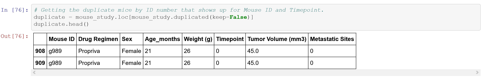
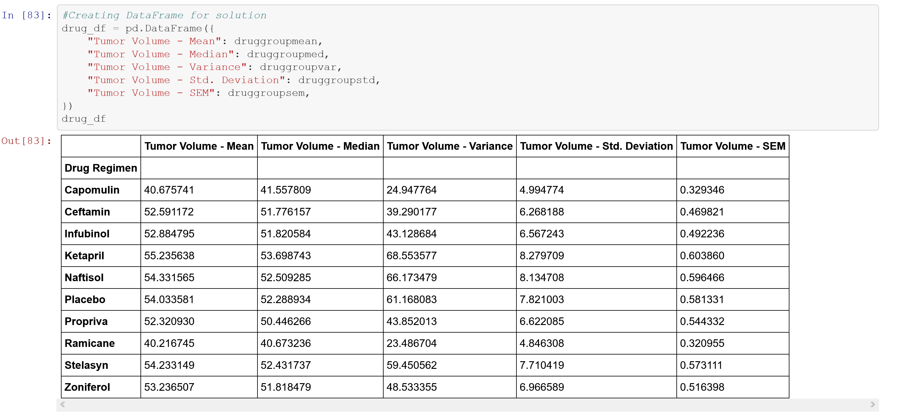
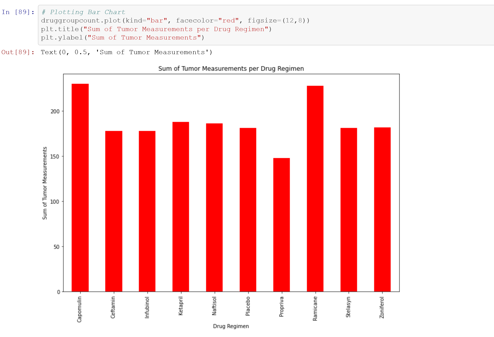
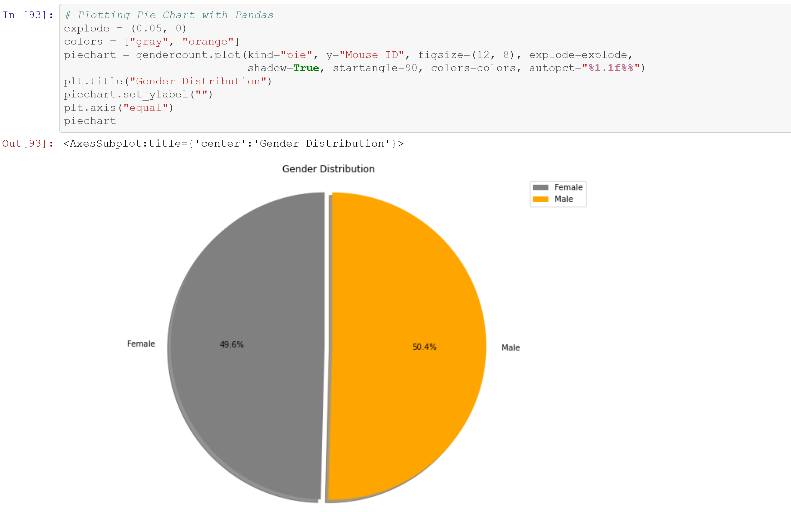
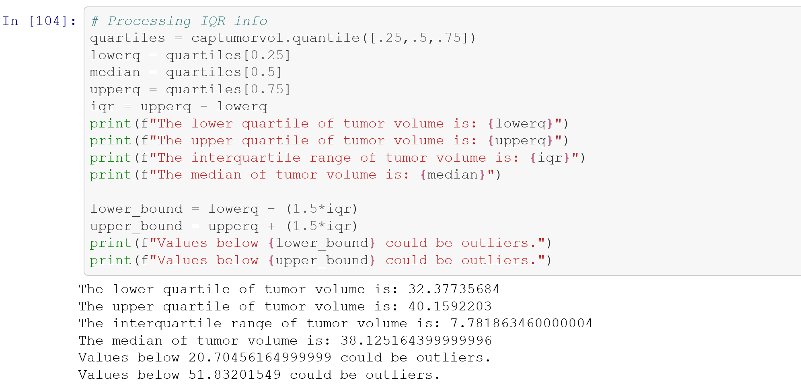
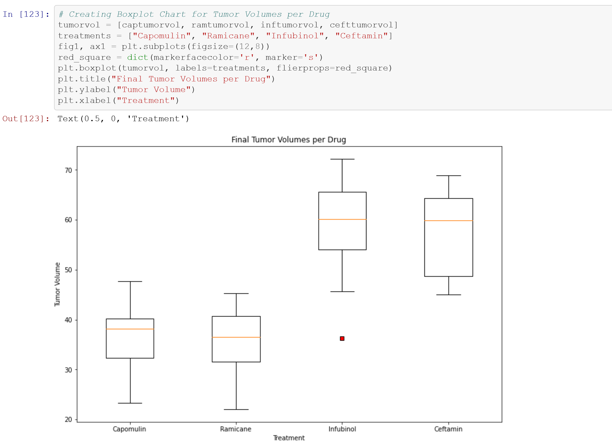
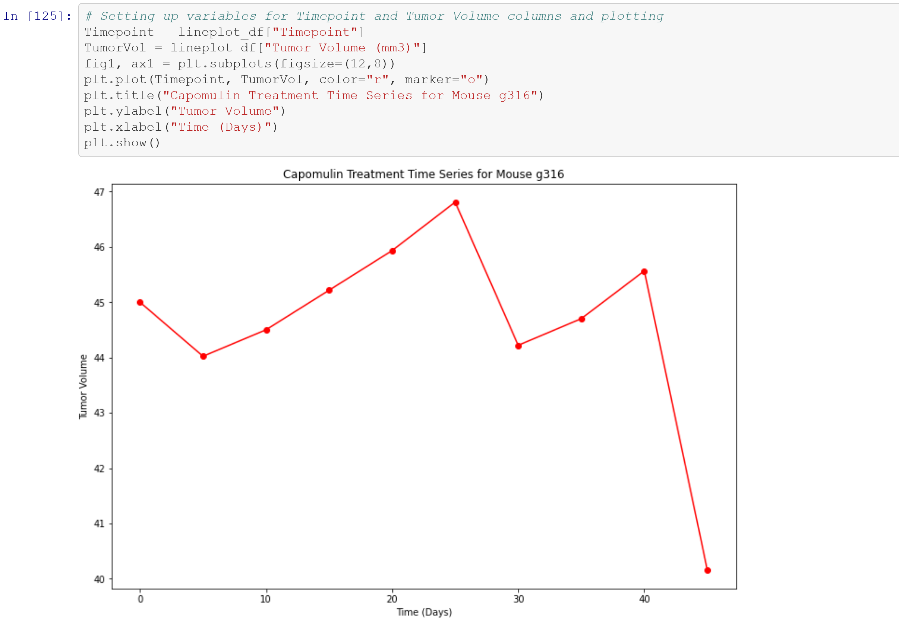

# pharma-study-analysis

In this exercise I am a senior data analyst at a pharmaceutical company called Pymaceuticals Inc.  

Pymaceuticals specializes in anti-cancer pharmaceuticals. 

In its most recent efforts, it began screening for potential treatments for squamous cell carcinoma (SCC), a commonly occurring form of skin cancer.  

I've been given access to the complete data from their most recent animal study. 

In this study, 249 mice identified with SCC tumor growth were treated through a variety of drug regimens. 

Over the course of 45 days, tumor development was observed and measured. 

The purpose of this study was to compare the performance of Pymaceuticals' drug of interest, Capomulin, versus the other treatment regimens. 

The executive team has asked for all of the tables and figures needed for the technical report of the study and also for a top-level summary of the study results. 

Tasks are the following:

- Before beginning the analysis, check the data for any mouse ID with duplicate time points and remove any data associated with that mouse ID

  

- Generate a summary statistics table consisting of the mean, median, variance, standard deviation, and SEM of the tumor volume for each drug regimen

  

- Generate a bar plot using both Pandas's DataFrame.plot() and Matplotlib's pyplot that shows the total number of measurements taken for each treatment regimen throughout the course of the study

  

- Generate a pie plot using both Pandas's DataFrame.plot() and Matplotlib's pyplot that shows the distribution of female or male mice in the study

  

- Calculate the final tumor volume of each mouse across four of the most promising treatment regimens: Capomulin, Ramicane, Infubinol, and Ceftamin. Calculate the quartiles and IQR and quantitatively determine if there are any potential outliers across all four treatment regimens

  

- Using Matplotlib, generate a box and whisker plot of the final tumor volume for all four treatment regimens and highlight any potential outliers in the plot by changing their color and style

  

- Select a mouse that was treated with Capomulin and generate a line plot of tumor volume vs. time point for that mouse

  

- Generate a scatter plot of mouse weight versus average tumor volume for the Capomulin treatment regimen

- Calculate the correlation coefficient and linear regression model between mouse weight and average tumor volume for the Capomulin treatment. Plot the linear regression model on top of the previous scatter plot.

